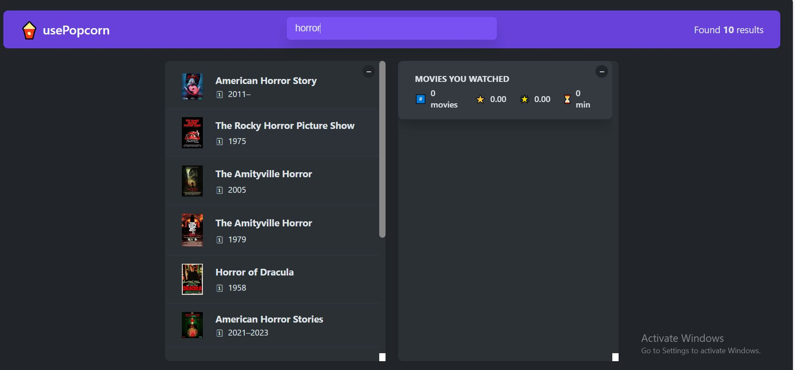

# 🍿 Project - PopCorn [Movie Rating Web App] 

## DESKTOP APP

### Technologies Used: React.js ⚛️

   Check the Demo - [Click here to view](https://vinayak9669.github.io/React_popcorn/)

#### What I've Learned from the PopCorn Project:

✔️ **User Input**

   - 🧐 Implemented a search bar to read user input and send it to the API component.
   - ⌨️ Enabled hitting the Enter key outside the search box to focus on the search bar while clearing previous searches.
   - ❌ Added a restriction to not call the API when the input character length is less than 3.

✔️ **API Integration with Custom Components**

   - 🔄 Utilized the `useEffect()` hook to fetch data from the API.
   - ❗ Managed errors during API requests.
   - 🔄 Shared the fetched data with the required sibling components.

✔️ **Data Representation in UI**

   - 📊 Displayed data in a list format.
   - 📋 Employed the `map` method with optional chaining to list down the data.

✔️ **Changing Document Title**

   - 📚 Changed the document title when a user clicks on any movie.

✔️ **Star Rating Component**

   - ⭐ Utilized props as a Component API for modifying star ratings.
   - 🌟 Allowed changing star colors, maximum ratings, default ratings, and star size.

✔️ **Addlist, Local Storage, and Delete Option**

   - 📦 Enabled the "Addlist" option when a user rates a movie, allowing it to be added to a watched list with personalized ratings.
   - 💼 Used local storage to store data of added movies to the watched list.
   - 🗑️ Implemented a delete option for removing movies from the list.

#### General Things Learned:

✔️ **General Skills**

   - 🏗️ How to split UI into components.
   - 🧩 Resolving the Prop Drilling issue.
   - 🛠️ Creating and using custom components.
   - 🌐 Effective handling of API requests.
   - 🔄 Leveraging the `useEffect()` hook for various use cases.
   - 📝 Understanding the use case of the `useRef()` hook (not implemented, but learned).

### Screenshots 

